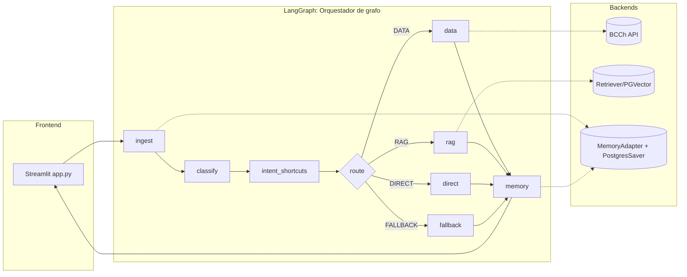

# PIBot BCCh – Chat IMACEC/PIB

Asistente Streamlit respaldado por LangGraph que responde dudas metodológicas y de series del BCCh
combinando datos oficiales, RAG con documentos internos y memoria conversacional.

## Inicio rápido
### Requisitos
- Python 3.12 administrado con [`uv`](https://astral.sh/uv)
- Cuenta BCCh (`BCCH_USER`, `BCCH_PASS`) con acceso a las APIs oficiales
- Credenciales de OpenAI (`OPENAI_API_KEY`) y servicios opcionales (Postgres, Redis, Azure AI Search)

### Instala dependencias

```bash
# Instala uv si no lo tienes
pip install uv

uv python install 3.12
uv sync
# (Opcional) activar entorno
.\.venv\Scripts\activate   # Windows
# source .venv/bin/activate  # macOS/Linux
```

**Dependencias clave incluidas:**
- `transformers`, `pytorch-crf` - Para clasificación JointBERT de intenciones y entidades
- `langchain`, `langgraph` - Orquestación de agentes
- `streamlit` - Interface de usuario
- `torch` - Deep learning (CPU por defecto)

### Variables de entorno mínimas

Copia `.env.example` a `.env` y configura:

```bash
cp .env.example .env
```

Edita `.env` y configura al menos `OPENAI_API_KEY`.

**Verifica tu instalación:**
```bash
python verify_setup.py
```

Este script comprueba:
- ✓ Versión de Python correcta
- ✓ Dependencias instaladas
- ✓ Variables de entorno configuradas
- ✓ Archivos del modelo JointBERT
- ✓ Carga correcta del modelo

| Variable | Descripción | Requerido |
| --- | --- | --- |
| `OPENAI_API_KEY`, `OPENAI_MODEL` | Modelo y clave usados por `LLMAdapter` | ✓ Sí |
| `BCCH_USER`, `BCCH_PASS` | Credenciales para `get_series.py` | ✓ Sí |
| `JOINT_BERT_MODEL_DIR` | Ruta al modelo JointBERT entrenado | No (default: `models/pibot_series_interpreter/pibot-jointbert`) |
| `USE_AGENT_GRAPH=1` | Habilita el grafo LangGraph en `main.py` | No |
| `PG_DSN`, `REQUIRE_PG_MEMORY` | Configuran memoria conversacional y checkpoints | No |
| `REDIS_URL`, `USE_REDIS_CACHE` | Cache para consultas BCCh | No |
| `RAG_ENABLED`, `RAG_BACKEND`, `RAG_PGVECTOR_URL` | Activa el retriever metodológico | No |

### Clonar modelo clasificador

```
# 1) Clonar BETO (tokenizer/base) → model/tokenizers/
hf download 

# 2) Clonar un modelo entrenado → model/weights/
uv run python model/scripts/clone_hf_model.py smenaaliaga/pibot-jointbert weights

# Opción 2 (versión antigua)
hf download smenaaliaga/pibot-jointbert \
  --revision e693d2bb422fa86c1bf2a493eba40b5a6c948020 \
  --local-dir ./model/out/pibot_model_beto \
  --local-dir-use-symlinks False
```

### Ejecuta la aplicación
```bash
uv run streamlit run main.py
```

Al iniciar, el sistema automáticamente:
1. ✅ Carga el modelo JointBERT (clasificador de intenciones) - ~6 segundos
2. ✅ Inicializa el grafo LangGraph
3. ✅ Prepara la memoria conversacional
4. ✅ Abre la interfaz web en `http://localhost:8501`

El entrypoint `main.py` prepara logging + configuración, invoca el grafo desde `orchestrator/` y la UI
se renderiza desde `app.py`.

## Arquitectura
- `main.py` crea `AppConfig`, inicializa memoria/checkpoints y transmite el grafo LangGraph con
	`stream_mode=["updates","custom"]`.
- `app.py` consume los eventos del grafo y muestra chunks, tablas CSV/CHART y follow-ups.
- `orchestrator/` contiene el grafo (`graph/agent_graph.py`), clasificadores/intents, ruteo, flujo de
	datos BCCh, RAG factory, prompts compartidos y memoria.
- `get_series.py` abstrae las llamadas a la API de series del BCCh con cache Redis y helpers de reprocesamiento.



Detalles extendidos y diagramas adicionales viven en `orchestrator/README.md`.

## Servicios locales (opcional)
Para memoria persistente, cache y RAG se recomienda levantar Postgres + Redis mediante Docker.

```bash
cd docker
docker compose build postgres      # sólo si cambiaste la imagen
docker compose --env-file ../.env up -d postgres redis
docker compose exec postgres psql -U postgres -d pibot -c "CREATE EXTENSION IF NOT EXISTS vector;"
```

Consulta `docker/README.md` para conocer volúmenes, migraciones y reinicios.

## Flujo de datos + RAG
1. **Series BCCh**: `get_series.py` usa las credenciales BCCh y opcionalmente Redis; la metadata de
	 apoyo se carga con `tools/load_series_metadata.py`, que pobla la tabla `series_metadata` usada por
	 `series/series_index.py`.
2. **RAG metodológico**: `rag.py` provee ABIs para PGVector, FAISS o Azure AI Search. Ejecuta
	 `docker/postgres/load_txt_rag.py` para indexar documentos usando embebidos OpenAI. El script acepta
	 banderas como `--manifest manifest.json`, `--purge-mode staged`, `--eval-report report.json` para
	 controlar ingestas incrementales.
3. **Memoria**: `memory/MemoryAdapter` lee/escribe `session_facts` y checkpoints en Postgres; ver
	 `docs/README_memory.md` para migraciones recientes.

## Flujo de trabajo para desarrolladores
- **Debug de streaming**: `tools/debug_graph_stream.py`, `tools/debug_llm_stream.py`.
- **CLI headless**: `tools/tmp_langgraph_test.py`, `tools/test_orch2_chunk.py`.
- **Pruebas**: `uv run pytest tests/` (ver `tests/README.md` para atajos como `tools/run_small_tests.py`).
- **Registro de prompts/planes**: `plan_agents/*.prompt.md` describe mejoras pendientes (phase2 prompt,
	dedupe de chunks, etc.).

## Documentación relacionada
- `orchestrator/README.md`: detalle del grafo, intents y configuración.
- `docs/README_memory.md`: esquema y migraciones de memoria.
- `docker/README.md`: stack local (Postgres, Redis) y loaders.
- `tests/README.md`: convención de pruebas.
- `plan_agents/`: hojas de ruta activas.
