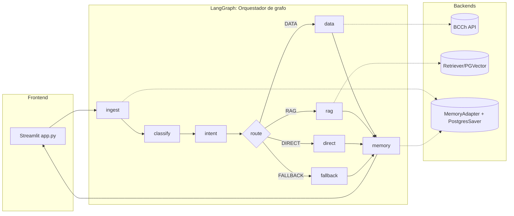

# PIBot BCCh – Chat IMACEC/PIB

Asistente Streamlit respaldado por LangGraph que responde dudas metodológicas y de series del BCCh
combinando datos oficiales, RAG con documentos internos y memoria conversacional.

## Inicio rápido
### Requisitos
- Python 3.12 administrado con [`uv`](https://astral.sh/uv)
- Cuenta BCCh (`BCCH_USER`, `BCCH_PASS`) con acceso a las APIs oficiales
- Credenciales de OpenAI (`OPENAI_API_KEY`) y servicios opcionales (Postgres, Redis)

### Instala dependencias

```bash
# Instala uv si no lo tienes
pip install uv

uv python install 3.12
uv sync
```

### Activar entorno

```bash
# macOS/Linux
source .venv/bin/activate

# Windows
.\.venv\Scripts\activate
```

**Dependencias clave incluidas:**
- `langchain`, `langgraph` — Orquestación de agentes
- `streamlit` — Interfaz de usuario

### Variables de entorno mínimas

Crea un archivo `.env` en la raíz del proyecto y configura al menos `OPENAI_API_KEY`.

| Variable | Descripción | Requerido |
| --- | --- | --- |
| `OPENAI_API_KEY`, `OPENAI_MODEL` | Modelo y clave usados por `LLMAdapter` | ✓ |
| `BCCH_USER`, `BCCH_PASS` | Credenciales para la API de series BCCh | ✓ |
| `PREDICT_URL` | Endpoint remoto de clasificación `/predict` | ✓ |
| `PG_DSN`, `REQUIRE_PG_MEMORY` | Memoria conversacional y checkpoints (Postgres) | ✓ |
| `REDIS_URL`, `USE_REDIS_CACHE` | Cache para consultas BCCh | Recomendado |
| `RAG_ENABLED`, `RAG_BACKEND`, `RAG_PGVECTOR_URL` | Retriever metodológico | Recomendado |
| `BDE_USER`, `BDE_PASS`, `BDE_BASE_URL` | Endpoint BDE (default: usa BCCH_*) | Opcional |
| `PREDICT_HEALTHCHECK_ON_START` | Health-check del modelo al arrancar (default: `1`) | ✓ |
| `INGEST_ON_START` | Pre-computa métricas derivadas al arrancar (default: `0`) | Opcional |

Todas las variables se centralizan en `config.py` (módulo + dataclass `Settings`).

### Ejecuta la aplicación
```bash
uv run streamlit run main.py
```

Al iniciar, el sistema automáticamente:
1. Configura logging (archivo en `logs/` + consola)
2. Verifica health del modelo remoto (`PREDICT_URL/health`)
3. Construye el grafo LangGraph (`orchestrator/graph/agent_graph.py:build_graph`)
4. Abre la interfaz web en `http://localhost:8501`

## Arquitectura

### Archivos raíz
| Archivo | Rol |
| --- | --- |
| `main.py` | Entry-point: logging, health-check, grafo, Streamlit |
| `app.py` | UI Streamlit: consume stream del grafo, muestra chunks/tablas/charts |
| `config.py` | Configuración centralizada (`Settings`, constantes de entorno) |

### Orquestador (`orchestrator/`)
| Módulo | Responsabilidad |
| --- | --- |
| `graph/` | Grafo LangGraph: `agent_graph.py`, nodos (`ingest`, `classify`, `intent`, `data`, `llm`, `memory`), estado, suggestions |
| `classifier/` | Clasificación vía endpoint remoto (`PREDICT_URL`) + intent store/memory |
| `normalizer/` | NER: normalización de entidades, períodos, texto, vocabularios, reglas de follow-up |
| `data/` | Fetch de series BCCh, business rules, response streaming, helpers |
| `llm/` | Adaptador LLM (OpenAI), system prompt |
| `rag/` | Fábrica de retrievers (PGVector/FAISS/Chroma) |
| `memory/` | Adaptador de memoria conversacional + LangGraph checkpoints (Postgres + fallback) |
| `catalog/` | Catálogo de series, búsqueda e ingest |
| `api/` | Cliente BDE (API de series BCCh) |
| `utils/` | Helpers compartidos: `pg_logging`, `http_client`, `period_normalizer`, `indicator_normalizer` |

### Flujo del grafo


```mermaid
flowchart LR
    subgraph Frontend
        UI[Streamlit app.py]
    end
    subgraph LangGraph: Orquestador de grafo
        IN[ingest]
        CL[classify]
        IS[intent]
        RT{route}
        DT[data]
        RG[rag]
        FB[fallback]
        DR[direct]
        MM[memory]
    end
    subgraph Backends
        S[(BCCh API)]
        R[(Retriever/PGVector)]
        M[(MemoryAdapter + PostgresSaver)]
    end

    UI --> IN --> CL --> IS --> RT
    RT -->|DATA| DT --> MM
    RT -->|RAG| RG --> MM
    RT -->|DIRECT| DR --> MM
    RT -->|FALLBACK| FB --> MM
    MM --> UI
    DT -.-> S
    RG -.-> R
    IN -.-> M
    MM -.-> M
```

Detalles extendidos y diagramas adicionales viven en `orchestrator/README.md`.

## Servicios locales (opcional)
Para memoria persistente, cache y RAG se recomienda levantar Postgres + Redis mediante Docker.

```bash
cd docker
docker compose build postgres      # sólo si cambiaste la imagen
docker compose --env-file ../.env up -d postgres redis
docker compose exec postgres psql -U postgres -d pibot -c "CREATE EXTENSION IF NOT EXISTS vector;"
```

Consulta `docker/README.md` para conocer volúmenes, migraciones y reinicios.

## Esquema de almacenamiento (Postgres/Redis)
- **Postgres**: memoria conversacional (`session_facts`, `session_turns`), checkpoints LangGraph y
    embeddings (`series_embeddings`).
- **Redis**: cache de series BCCh con claves tipo
    `bcch:series:{series_id}:{firstdate}:{lastdate}:{frequency}:{agg}`.

Para crear tablas manualmente: `psql -f docker/postgres/init.sql`
(o levanta el contenedor Postgres, que lo ejecuta al inicio).

ER diagram completo en [orchestrator/README.md](orchestrator/README.md).

## Flujo de datos + RAG
1. **Series BCCh**: `orchestrator/data/get_data_serie.py` usa las credenciales BCCh y opcionalmente Redis.
   La metadata de apoyo se carga con `tools/load_series_metadata.py` (tabla `series_metadata`).
2. **RAG metodológico**: `orchestrator/rag/rag_factory.py` provee retrievers para PGVector, FAISS o
    Chroma. Ejecuta `docker/postgres/load_txt_rag.py` para indexar documentos usando embeddings
   OpenAI. El script acepta banderas como `--manifest`, `--purge-mode staged`, `--eval-report`.
3. **Memoria**: `orchestrator/memory/memory_adapter.py` lee/escribe `session_facts` y checkpoints en Postgres.

## Herramientas para desarrolladores

| Herramienta | Uso |
| --- | --- |
| `tools/debug_graph.py` | Debug del grafo (invoke por defecto; `--stream` para streaming) |
| `tools/debug_llm.py` | Debug del LLM (`--stream` para streaming) |
| `tools/debug_data_response_stream.py` | Debug del pipeline de datos |
| `tools/test_bcch_connectivity.py` | Verifica conectividad con la API BCCh |
| `tools/warm_redis_cache.py` | Pre-calienta cache Redis con series |
| `tools/load_series_metadata.py` | Carga metadata de series a Postgres |
| `tools/run_small_tests.py` | Runner rápido de tests seleccionados |
| `tools/extract_questions.py` | Extrae preguntas desde logs |
| `tools/clean.py` | Limpieza de texto para documentos RAG |

### Tests
```bash
uv run pytest tests/ -v
```

Ver `tests/README.md` para convenciones y atajos.

## Documentación relacionada
- [orchestrator/README.md](orchestrator/README.md) — Grafo, intents, almacenamiento, diagramas ER
- [docker/README.md](docker/README.md) — Stack local (Postgres, Redis) y loaders
- [tests/README.md](tests/README.md) — Convención de pruebas
- [docs/BUSINESS_RULES_README.md](docs/BUSINESS_RULES_README.md) — Reglas de negocio
- [docs/FOLLOWUP_SUGGESTIONS.md](docs/FOLLOWUP_SUGGESTIONS.md) — Sistema de sugerencias
