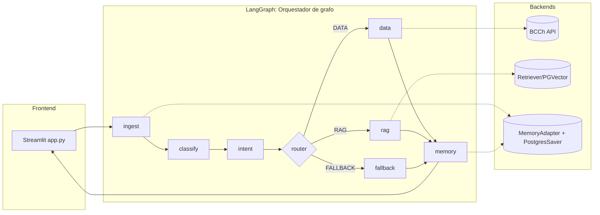

# Orchestrator PIBot

Motor LangGraph que encapsula todo el flujo del asistente económico: clasificación híbrida, intents
deterministas, llamadas a la API de series del BCCh, respuestas con RAG metodológico y memoria
conversacional. `main.py` activa el grafo estableciendo `USE_AGENT_GRAPH=1` y la UI de Streamlit
renderiza lo que llega por los canales `updates` (estado) y `custom` (chunks de texto).

## Arquitectura general

### Flujo detallado
1. **ingest** normaliza la pregunta, garantiza `session_id`, recupera una ventana corta de conversación
   desde `MemoryAdapter` y arma el `context` base.
2. **classify** usa `orchestrator/prompts/query_classifier.py` y `classifier_agent.py` para obtener un
   `ClassificationResult` + `history_text` y genera `intent_info` estructurado.
3. **intent** consulta el `IntentRouter` clásico, rellena entidades con el historial y propone un
   `route_decision` (`data`, `rag` o `fallback`).
4. **router** valida la decisión (p. ej. follow-ups de gráficos) y fan-out hacia el nodo final.
5. **data** dispara `data_router.stream_data_flow` → `data/data_flow.py`, que produce la fase
   metodológica, tablas, markers de CSV/gráfico y follow-ups.
6. **rag** alimenta `LLMAdapter` con el retriever creado por `rag/rag_factory.py` (PGVector/FAISS/Chroma).
7. **fallback** usa el mismo adapter pero sin retriever, ideal para consultas out-of-domain.
8. **memory** sincroniza la salida completa con LangGraph checkpoints + Postgres (o `MemorySaver` en
   local) y conserva metadata relevante (por ejemplo, dominios de gráficos detectados en la salida).

## Mapa de carpetas
| Ruta | Rol principal |
| --- | --- |
| `graph/` | Define `AgentState`, nodos LangGraph y utilidades de streaming. |
| `classifier/` | Clasificadores híbridos (`classifier_agent.py`, normalizadores, heurísticas). |
| `catalog/` | Declaración de intents y helpers para expandir patrones JSON. |
| `routes/` | Rutas deterministas (`intent_router.py`, `data_router.py`). |
| `data/` | Flujo de series BCCh: prompts, fetch, tablas, markers, follow-ups. |
| `prompts/` | Registro de prompts y el `query_classifier.py` (function calling). |
| `llm/` | `LLMAdapter` y construcción del mensaje de sistema con guardrails. |
| `rag/` | Fábrica de retrievers para PGVector/FAISS/Chroma. |
| `memory/` | Adaptadores de memoria conversacional + LangGraph checkpoints (Postgres + fallback). |
| `utils/` | utilidades compartidas (`pg_logging`, `followups`). |

## Contrato de streaming
- `_emit_stream_chunk` envía cada fragmento a `StreamWriter` y al runtime (`custom` event). La UI
   muestra los chunks tal cual llegan y detecta markers (`##CSV_DOWNLOAD_START`, `##CHART_START`).
- `Topic(str, accumulate=True)` en `AgentState.stream_chunks` conserva el historial para pruebas con
  `tools/debug_graph_stream.py` o `tools/debug_llm_stream.py`.
- Los nodos pueden adjuntar metadata usando `updates` (estado) para que Streamlit muestre barras de
  progreso o banners reutilizables.

## Variables y toggles clave
- **Grafo**: `USE_AGENT_GRAPH`, `AGENT_DATA_MAX_ATTEMPTS`, `LANGGRAPH_CHECKPOINT_NS`.
- **LLM/RAG**: `OPENAI_MODEL`, `OPENAI_API_KEY`, `RAG_ENABLED`, `RAG_BACKEND`, `RAG_PGVECTOR_URL`,
  `RAG_TOP_K`, `OPENAI_EMBEDDINGS_MODEL`.
- **Datos BCCh**: `BCCH_USER`, `BCCH_PASS`, `USE_REDIS_CACHE`, `REDIS_URL`, `REDIS_SERIES_TTL`,
  `series/config_default.json`.
- **Memoria**: `PG_DSN`, `REQUIRE_PG_MEMORY`, `LANGGRAPH_CHECKPOINT_NS`, `MEMORY_MAX_TURNS_PROMPT`,
  `MEMORY_MAX_TURNS_STORE`.
- **Logging**: `RUN_MAIN_LOG`, `LOG_LEVEL`, `LOG_EXPOSE_API_LINKS`, `THROTTLED_PG_LOG_PERIOD`.

## Desarrollo y pruebas
- `tools/debug_graph_stream.py` y `tools/debug_graph_invoke.py`: validan streaming LangGraph (updates vs
  custom) y muestran markers en consola.
- `tools/test_orch2_chunk.py`: smoke test completo del grafo, útil en CI o tras cambios grandes.
- `pytest tests/test_orchestrator2.py tests/test_agent_graph_streaming.py`: validan clasificación,
  ruteo y emisión de markers.
- `plan_agents/*.prompt.md`: hojas de ruta activas (mejoras en prompts, deduplicación de chunks,
  prompt audit, etc.).

## Documentación relacionada
- [README raíz del proyecto](../README.md)
- [README del grafo](graph/README.md)
- [README de datos](data/README.md)
- [README del clasificador](classifier/README.md)
- [README de RAG](rag/README.md)
- [README de memoria](memory/README.md)
- [README de Docker](../docker/README.md)
- [README de pruebas](../tests/README.md)
