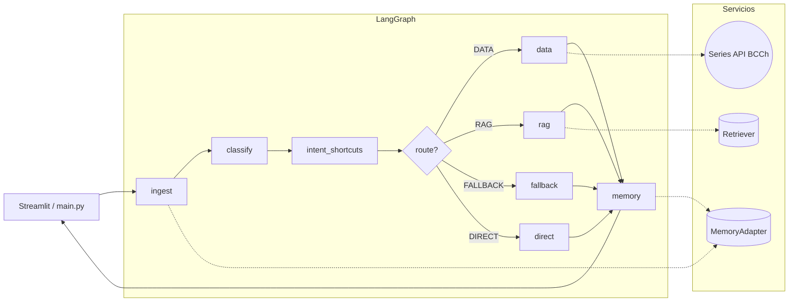

# Orchestrator PIBot

Grafo LangGraph que coordina clasificación, intents deterministas, flujo de datos BCCh, RAG
metodológico y memoria conversacional. `USE_AGENT_GRAPH=1` viene habilitado en `main.py` y la UI de
Streamlit consume los eventos `updates` + `custom` que emite este grafo.

## Mapa de carpetas
- `graph/`: definición del grafo (`agent_graph.py`) y del `AgentState` compartido.
- `intents/`: clasificadores LLM + heurísticas (`classifier_agent.py`, `joint_intent_classifier.py`, etc.).
- `catalog/`: intents declarativos en JSON + helpers para expandir patrones.
- `routes/`: ruteo determinista (`intent_router.py`, `data_router.py`).
- `data/`: flujo completo de series (prompts, fetch, tablas, markers).
- `llm/`: `LLMAdapter` + `system_prompt` con soporte de streaming y RAG.
- `rag/`: fábrica de retrievers (PGVector/FAISS/Chroma).
- `memory/`: `MemoryAdapter` para facts + LangGraph checkpoints.
- `utils/`: helpers comunes (`pg_logging`, `followups`).

## Flujo extremo a extremo

### Pasos detallados
1. **Ingest**: limpia la pregunta, asegura `session_id`, consulta facts en memoria y arma `context`.
2. **Classify**: `classifier_agent` produce `ClassificationResult` + `history_text`, luego
   `build_intent_info` agrega entidades y facts.
3. **Intent shortcuts**: ejecuta intents deterministas (catálogo JSON + heurísticas); si devuelve
   chunks, el grafo responde por la rama `direct`.
4. **Route**: decide entre `data`, `rag`, `fallback` o `direct` usando `classification.query_type`,
   intents y disponibilidad de datos.
5. **Data**: `data_router.stream_data_flow` delega a `data_flow.stream_data_flow_full`, que emite
   metodología, tablas, markers CSV/CHART y follow-ups.
6. **RAG**: `LLMAdapter` recibe el retriever de `rag_factory` y responde citando documentos.
7. **Fallback**: LLM genérico con el mismo adapter pero sin retriever.
8. **Memory**: persiste la respuesta y actualiza facts vía `MemoryAdapter` (PostgresSaver cuando está
   disponible, fallback local en ambientes sin DB).

## Streaming
- `_emit_stream_chunk` envía cada fragmento por dos vías: writer explícito y `get_runtime().stream_writer`.
- `app.py` escucha `stream_mode=["updates","custom"]`; `custom` trae `{"stream_chunks": "texto"}` y se
  muestra token a token en la UI.
- `Topic(stream_chunks, accumulate=True)` guarda los chunks para pruebas (`tools/debug_graph_stream.py`).

## Configuración clave
- **Grafo**: `USE_AGENT_GRAPH`, `AGENT_DATA_MAX_ATTEMPTS`, `LANGGRAPH_CHECKPOINT_NS`.
- **LLM / RAG**: `OPENAI_MODEL`, `OPENAI_API_KEY`, `RAG_ENABLED`, `RAG_BACKEND`, `RAG_PGVECTOR_URL`,
  `RAG_TOP_K`.
- **Datos**: `USE_REDIS_CACHE`, `REDIS_URL`, `REDIS_SERIES_TTL`, defaults de series en
  `series/config_default.json`.
- **Memoria**: `PG_DSN`, `REQUIRE_PG_MEMORY`, `MEMORY_MAX_TURNS_PROMPT`, `MEMORY_FACTS_LAYOUT`.
- **Logging**: `LOG_LEVEL`, `RUN_MAIN_LOG`, `LOG_EXPOSE_API_LINKS`.

## Desarrollo / pruebas
- `tools/debug_graph_stream.py`: compara `updates`, `values` y `custom` para validar streaming.
- `tools/test_orch2_chunk.py`: smoke test que ejecuta el grafo completo y verifica markers.
- `pytest tests/test_orchestrator2.py tests/test_orch2_chunk.py`: cobertura principal del orquestador.

## Documentación relacionada
- [README raíz del proyecto](../README.md)
- [README de catalogo](catalog/README.md)
- [README de data](data/README.md)
- [README de grafo](graph/README.md)
- [README de Docker](../docker/README.md)
- [README de pruebas](../tests/README.md)
- [README de scripts auxiliares](../readme/README.md)
